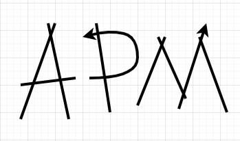

# 基于注意力的项目管理工具使用手册（CLI版)
## INTRODUCTION
> 时间管理是非常重要的，在这之前已经尝过很多的时间管理方法，但是都似乎不是很还用。归根结底，这些方法都只是规划了自己在什么时间做什么事情。
> 我以为在当前这个信息爆炸的时代，我们的时间管理目标应该在于管理我们的注意力，控制住我们的大脑关注我们当下的事情。而不是淹没在短视频等信息中无法自拔。
> 通过一个个项目的形式来管理我们的时间能帮助我们更好地整理思路，确定我们的当下工做的目标，步骤，结果。
> 帮助我们更好地关注我们具体所做的事情，分析我们的时间花费在何处。
> > **Attention-based Project Management, APM**   
> > **version 0.1**
## 设计哲学
> 这是一个轻量级的小程序，也是我开发的第一个小程序。经过简单的调研，决定通过 python + python prompt toolkit + pyinstaller。
> 交互方面先开发命令行交互的CLI版本已经能满足我的目标，后续若扩展更多的功能再考虑GUI界面的设计。总的来说程序设计的指导思想如下：
> 1. 采取最轻量的内容管理，只打算使用json格式来保存文件。每个项目对应的大量各种格式的文件，网址，说明性的文字统一使用固定格式的字段来保存路径即可
> 2. 数据和工具分离，所有的数据信息均保存在一系列json文件中，这些文件可以方便地保存，复制。
> 3. 每条数据记录由固定字段构成的模块构成，支持三种各司其职的模块
>    + DOCUMENT
>      + doc_outline
>      + doc_file
>    + ACTION 
>      + goal
>      + methods
>      + feedback
>      + related_file
>    + RECORD
>      + start_time
>      + end_time
>      + start_passion_score
>      + end_feeling_score
>      + attention_score
>      + passion_description
>      + feeling_description
>      + attention_description
>      + work_env_description
> 4. 支持指令自动补全，快速编辑
> 
